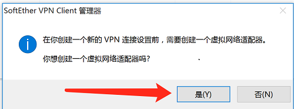

# Softether-client连接教程

> 简单教程：直接下载软件，然后打开，设置连接输入目标地址、用户名和密码，然后点击连接。注意：最好关闭360、腾讯管家等软件，因为会自动拦截和屏蔽。

### 步骤1：
* 先点击连接下载[client软件](http://jame.sedns.cn:8088/soft/client.exe)，最好直接下载到桌面，打开软件，如下图所示：

* 点击下一步
 

* 选择是

* 直接下一步

* 勾选我同意，直接下一步

* 直接下一步

* 直接下一步

* 直接下一步

* 点击完成后，软件自动打开

* 双击添加新的VPN连接

* 选择是

* 默认适配器名字为VPN（**不要更改**）

* 等待创建完成

* 创建完成后，重新打开添加新的VPN连接

* 按照负责人分配的主机名、端口号、用户名和密码输入，以及默认的HUB名：VPN，然后点击确定，添加完成

* 然后鼠标选中，按回车，或者右键选择连接

* 提示连接成功，拍牌专用

* 查看[百度ip](https://www.baidu.com/s?tn=99006304_1_oem_dg&isource=infinity&wd=ip)是否改变，如果变成上海市电信，说明设置成功

***
***