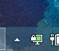

# VPN连接教程
* 如果是上海电信同学需要设置服务器端程序的，请点击**[链接](./tutorial_server.html)**进行跳转
## 方法1：ssr连接

> 简单教程：直接下载软件，然后打开，检查下是否打开了全局代理，然后就可以使用了。注意：最好关闭360、腾讯管家等软件，因为会自动拦截和屏蔽。

### 步骤1：
* 先点击连接下载[ssr软件](http://jame.sedns.cn/soft/ssr-4.7.0-win.rar)，最好直接下载到桌面,然后解压到当前目录，如下图所示：

* 解压到当前文件夹
 

* 打开下载后的文件夹

* 点击打开 ShadowsocksR-dotnet4.0.exe

* 查看是否全局代理

* 查看[百度ip](https://www.baidu.com/s?tn=99006304_1_oem_dg&isource=infinity&wd=ip)是否改变，如果变成上海市电信，说明设置成功

***
***

## 方法2：Openvpn连接
### 步骤1：
* 先点击连接下载[openvpn软件](http://jame.sedns.cn/soft/openvpn-install-2.4.4-I601.exe)，然后双击安装，如下图所示：

* 一直点击下一步就可以了

* 点击安装

* 可以看到桌面多了软件图标，双击打开

* 打开提示找不到文件，直接确定，然后下载[配置文件](http://jame.sedns.cn/soft/jame-pc_openvpn_remote_access_l3.ovpn)到桌面

* 回到电脑右下角找到带钥匙的电脑图标，然后右键点击，选择import file

* 找到刚刚下载的配置文件

* 点击确定

* 回到右下角右键点击软件图标，然后选择连接

* 输入分配的验证码和密码，点击ok

* 连接完成后，可以看到小电脑变绿了。

* 查看[百度ip](https://www.baidu.com/s?tn=99006304_1_oem_dg&isource=infinity&wd=ip)是否改变，如果变成上海市电信，说明设置成功

***
***