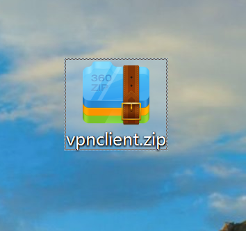
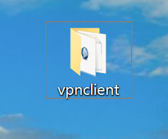
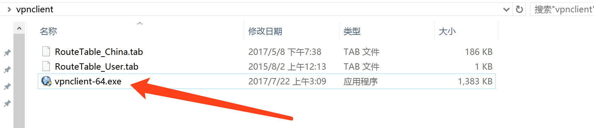
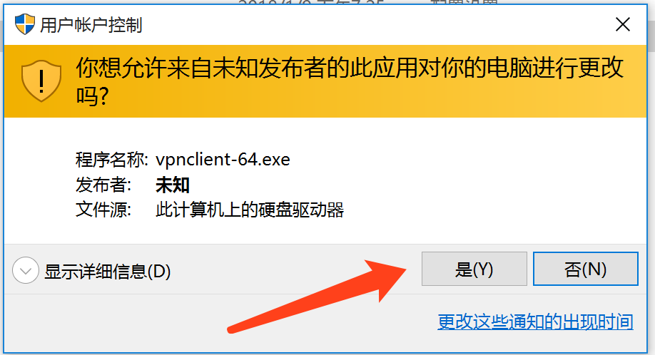
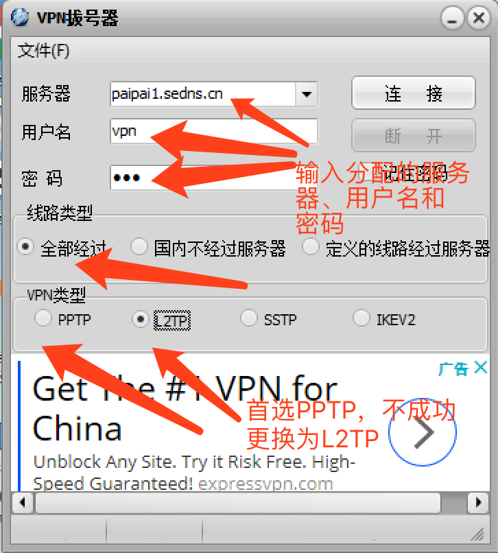
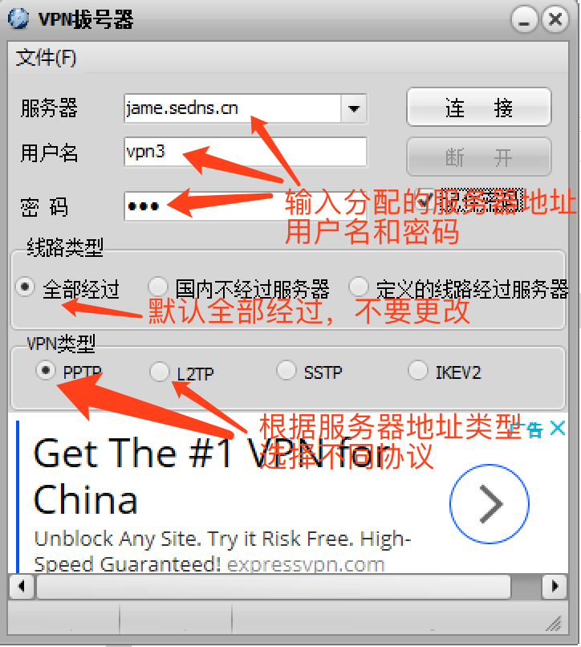
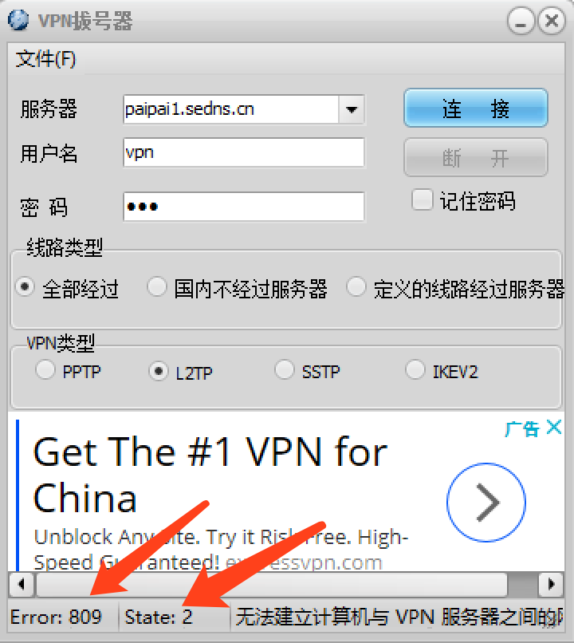
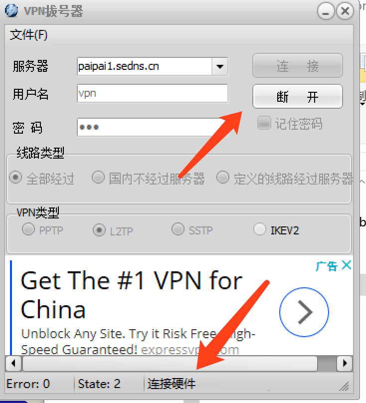
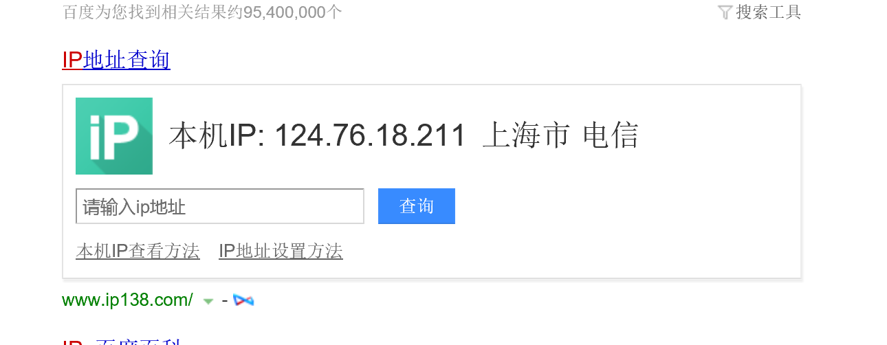

#VPN连接教程

> 简单教程：直接下载软件，然后打开，设置分配的服务器地址、用户名和密码，软后选择协议，连接就可以使用了。注意：最好关闭360、腾讯管家等软件，因为会自动拦截和屏蔽。

### 步骤1：
* 先点击连接下载[vpnclient软件](http://jame.sedns.cn:8088/soft/vpnclient.zip)，最好直接下载到桌面,然后解压到当前目录，如下图所示：

* 解压到当前文件夹
 

* 打开下载后的文件夹，打开vpnclient-64.exe

* 选择是

* 输入分配的IP或者域名、用户名和密码（**若服务器为IP地址，如：220.186.18.2，协议选择为PPTP，若服务器为网址，如:paipai2.com的协议选择为L2TP**）

* 点击连接（可能出现无法一次就连接成功，断开后重新连接）

* 连接失败后，下面有提示

* 注意最下面的提示，连接成功后软件自动最小化

* 连接成功，软件自动最小化，可以到最下面找到

* 查看[百度ip](https://www.baidu.com/s?tn=99006304_1_oem_dg&isource=infinity&wd=ip)是否改变，如果变成上海市电信，说明设置成功

# 有任何问题及时联系负责人 

***
***